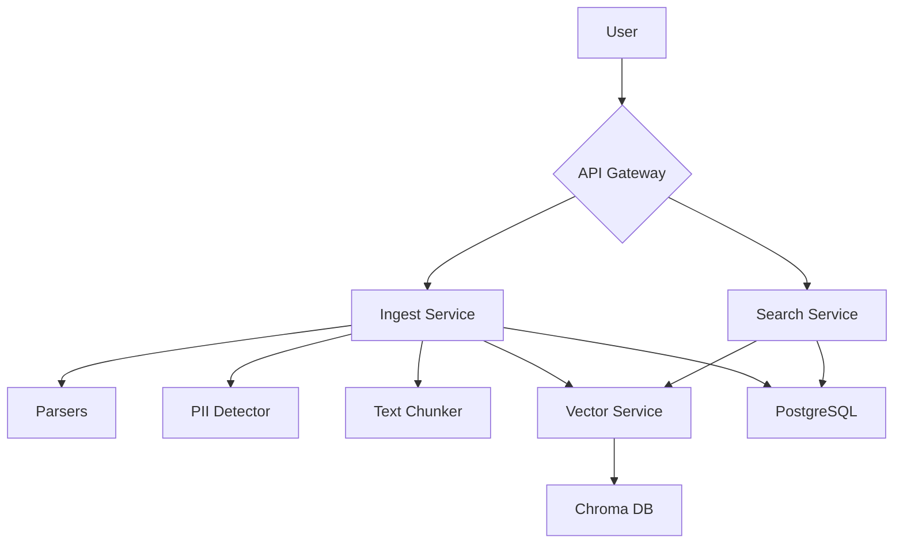
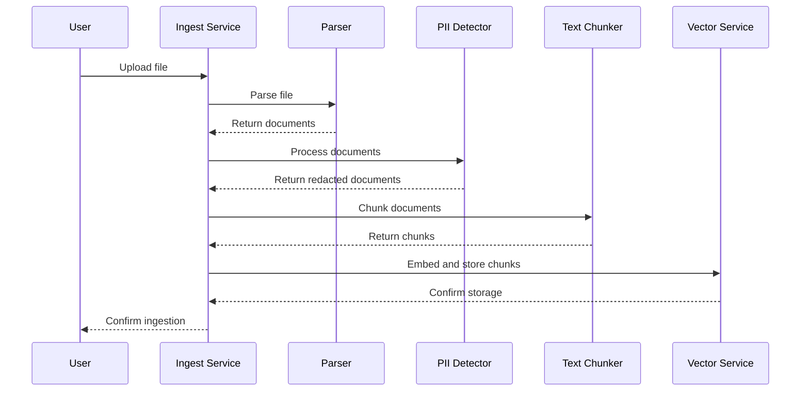

# Architecture

The Analyst Copilot system is designed with a microservices architecture to ensure scalability, flexibility, and maintainability. Each component is responsible for a specific set of tasks and communicates with other components through well-defined APIs.

## System Components

The following diagram illustrates the high-level architecture of the Analyst Copilot system:

- **API Gateway**: The single entry point for all API requests. It handles authentication, rate limiting, and routing to the appropriate microservice.
- **Ingest Service**: Responsible for handling file uploads, text pastes, and orchestrating the ingestion workflow.
- **Search Service**: Provides a semantic search interface to query the ingested data.
- **Parsers**: A collection of modules that extract text and metadata from various file formats (e.g., Jira CSV, Confluence HTML, PDF).
- **PII Detector**: Identifies and redacts personally identifiable information (PII) from the extracted text.
- **Text Chunker**: Splits the processed text into smaller, semantically meaningful chunks for embedding.
- **Vector Service**: Manages the interaction with the vector database, including storing and retrieving vector embeddings.
- **Chroma DB**: The vector database used to store and search for similar vector embeddings.
- **PostgreSQL**: The relational database used to store metadata about ingest jobs, knowledge chunks, and other system information.

## Ingestion Workflow

The following sequence diagram illustrates the data ingestion workflow:

## Technology Stack

- **Backend**: Python, FastAPI
- **Database**: PostgreSQL, Chroma DB
- **Messaging**: Redis, Celery
- **Frontend**: (To be determined)
- **Deployment**: Docker, Docker, Docker, Docker, Docker, Docker, Docker, Docker, Docker, Docker, Docker, Docker, Docker, Docker, Docker, Docker, Docker, Docker, Docker Compose
